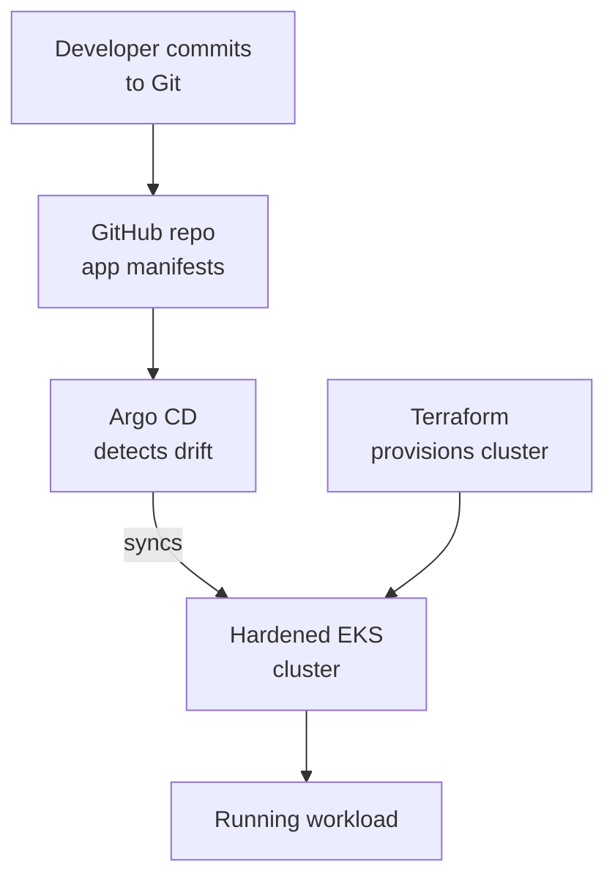

# EKS GitOps Platform

[](https://github.com/Corrierethan/eks-gitops-platform/actions/workflows/ci.yml)

A hardened **Amazon EKS** cluster provisioned with **Terraform** and managed via **Argo CD**
GitOps — built to align with the **CIS Kubernetes Benchmark**, the **NSA/CISA Kubernetes
Hardening Guide**, and **NIST SP 800-53**. Built by **Ascent DevOps**
(Veteran-Owned Small Business, SDVOSB).

Designed to run in **AWS GovCloud (US)** — region and partition are Terraform variables, so the
same code deploys to both `aws` and `aws-us-gov` partitions. All workload images pull from
**Amazon ECR** (no public registries).

---

## What this provides



| Component | What it does | NIST control |
|-----------|-------------|--------------|
| EKS private endpoint | No public API server | SC-7 |
| IRSA | Pod-level IAM — no long-lived keys | AC-6, IA-5 |
| KMS secrets encryption | Encrypts etcd secrets at rest | SC-28 |
| CIS-hardened nodes | Reduces attack surface | CM-6, CM-7 |
| Network policy (default-deny) | Micro-segmentation | SC-7, AC-4 |
| Pod Security (restricted) | No privileged containers | CM-7 |
| Argo CD GitOps | All changes via reviewed PR | CM-3, CM-5 |

---

## Repository layout

```
eks-gitops-platform/
├── terraform/             # EKS cluster, node groups, IRSA, KMS, ECR
├── gitops/                # Argo CD bootstrap + app-of-apps + sample workload
├── policies/              # Network policies, Pod Security, RBAC
├── docs/
│   ├── hardening.md       # CIS Benchmark + NSA/CISA item mapping
│   ├── deploy.md          # End-to-end deployment walkthrough
│   └── nist-control-mapping.md
└── scripts/
    └── seed-issues.ps1
```

---

## Deployment overview

1. `terraform apply` provisions the EKS control plane, managed node groups, IRSA, KMS, and ECR.
2. Argo CD is bootstrapped into the cluster.
3. An **app-of-apps** Application points Argo CD at `gitops/` — everything else (add-ons,
   policies, sample workload) is reconciled from Git automatically.

See [docs/deploy.md](docs/deploy.md) for the full walkthrough.

---

*Built by Ascent DevOps · Veteran-Owned · SDVOSB*
